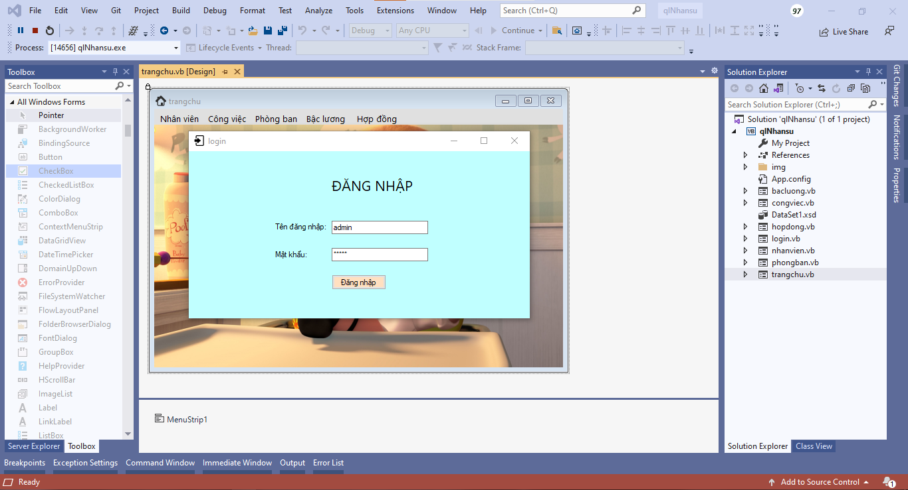
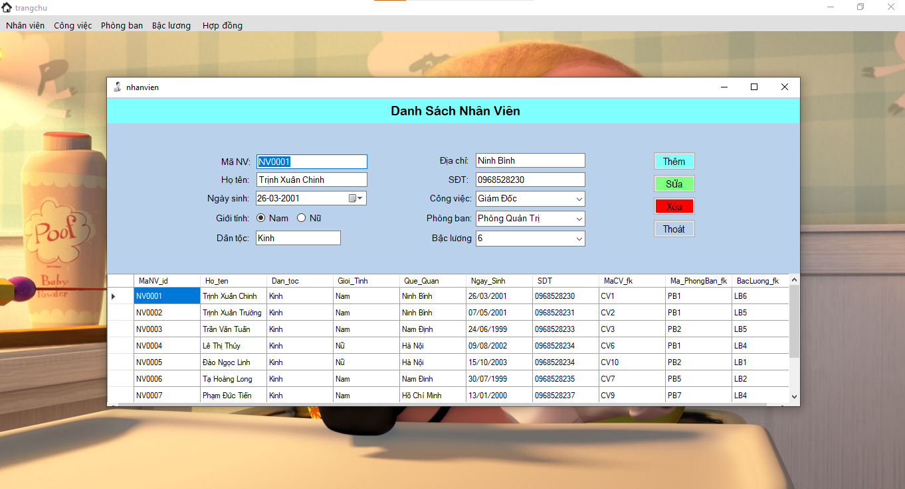
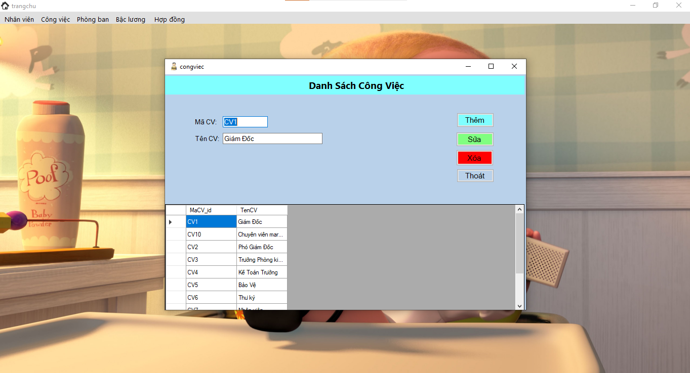
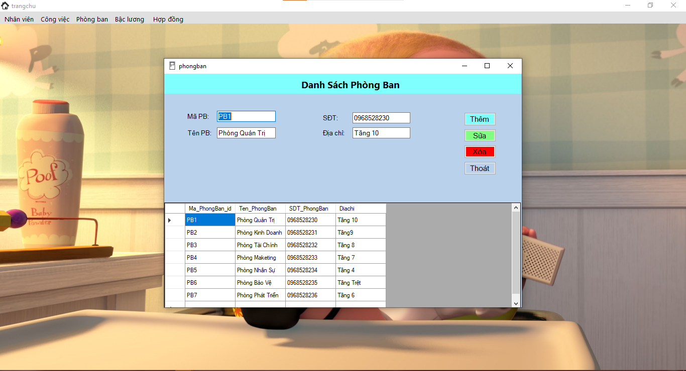
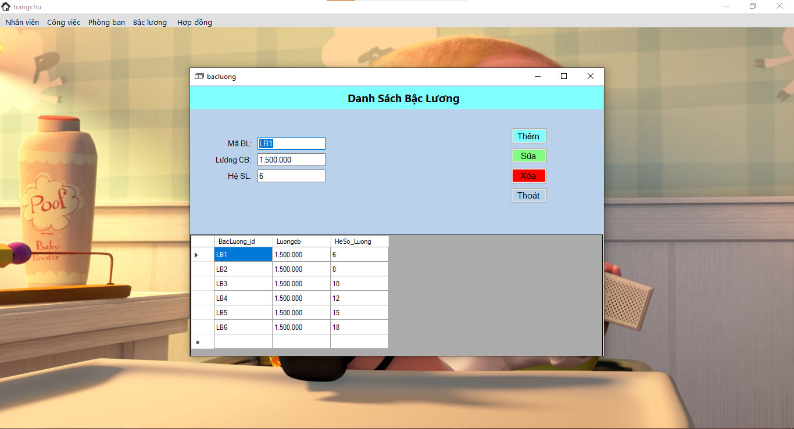
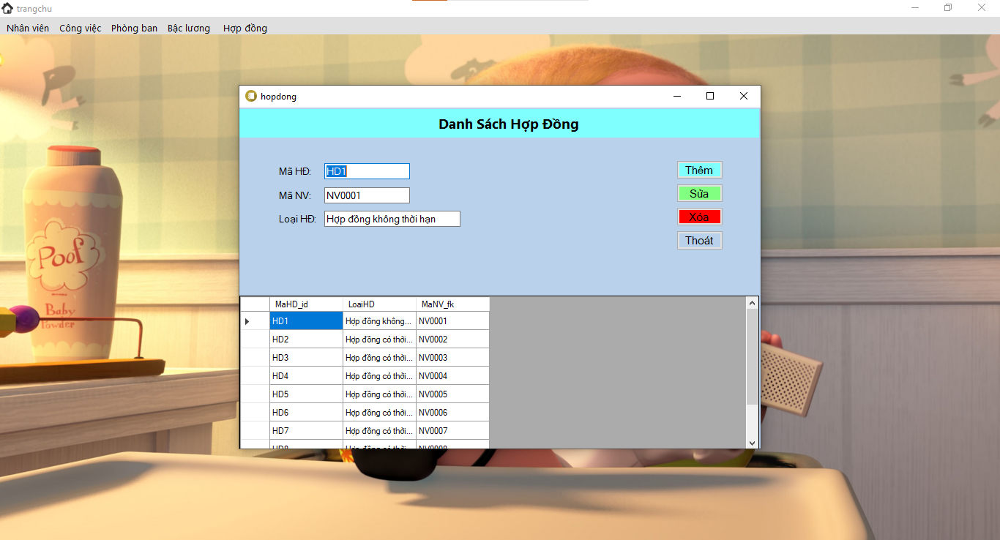

# Đồ Án Visual Basic

## Đề tài: Quản lý nhân sự

Clone this repository
``` shell
git clone https://github.com/xuanchinh97/Do-An-Visual-Basic.git
```

### Yêu cầu phần mềm:
- Visual Studio, SQL Server

### Form
- Gồm có 7 form: form login, trang chủ, nhân viên, công việc, phòng ban, bậc lương, hợp đồng
- Chức năng cơ bản: Thêm, Sửa, Xóa

### Use
- restore database/quanlynhansu.bak vào trong sql server
- mở file qlNhansu.sln
- kết nối tới file database ở trên vào visual studio
- kết nối xong nếu chạy báo lỗi thì các b tìm hiểu thêm nhé :v chắc phải cấu hình sửa lại đấy

### Nguồn hướng dẫn
https://youtube.com/playlist?list=PL9xOHE9fTEnAwRJI1VWAYPCpu-FFoKj68

### Screenshot








